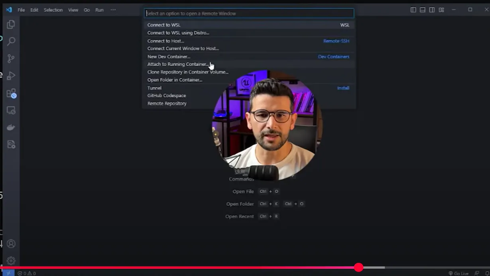
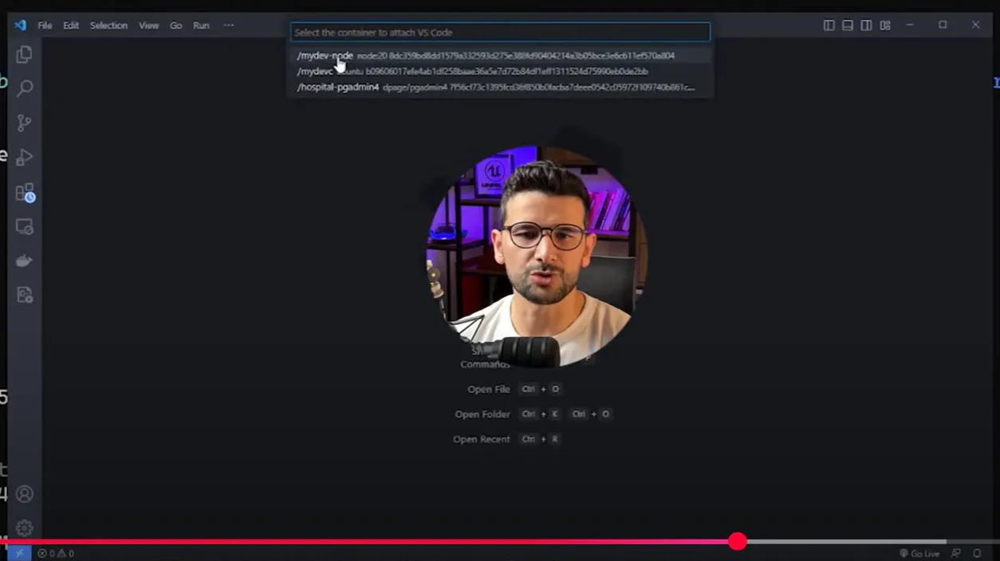
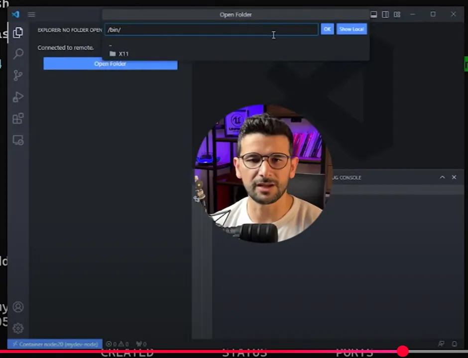
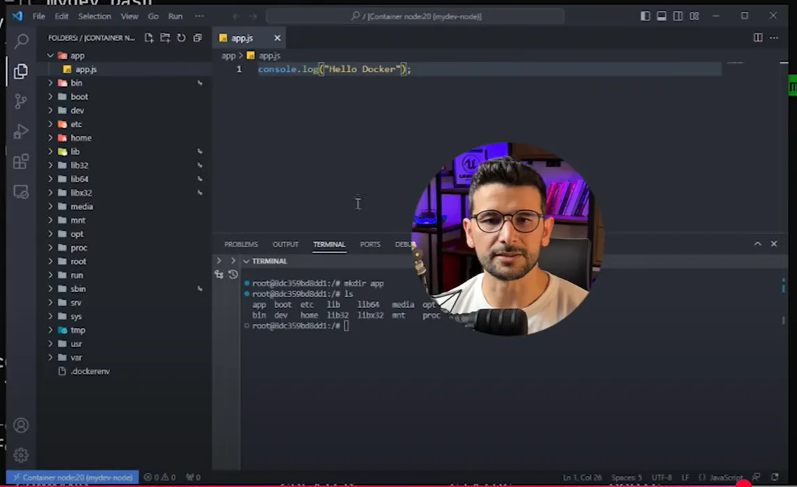
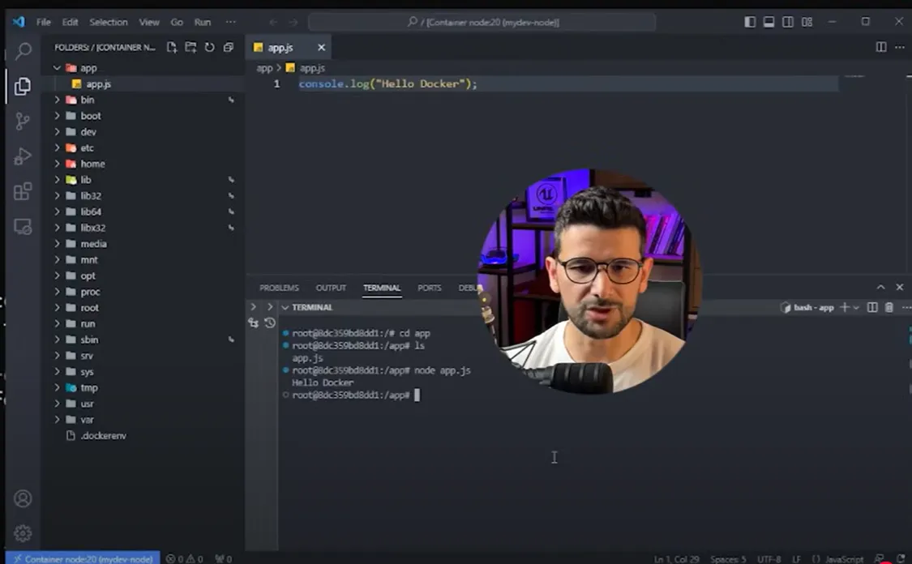
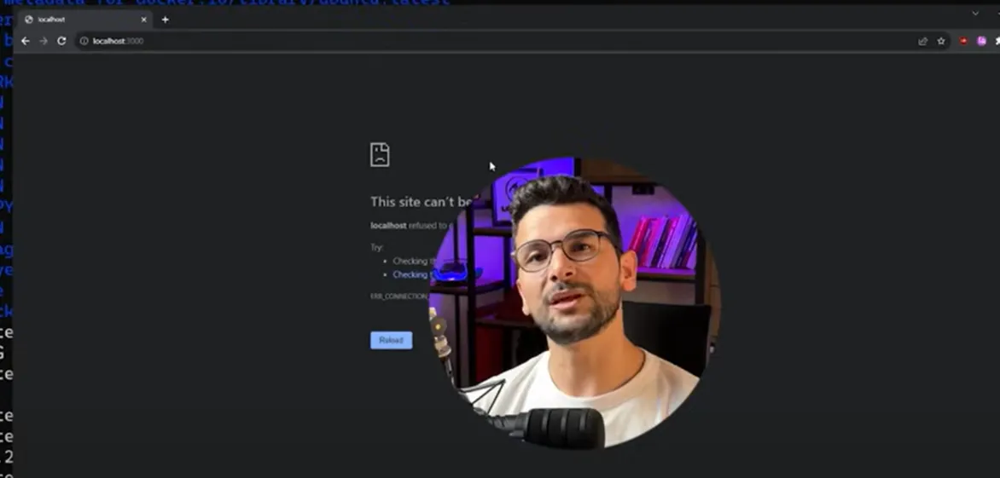
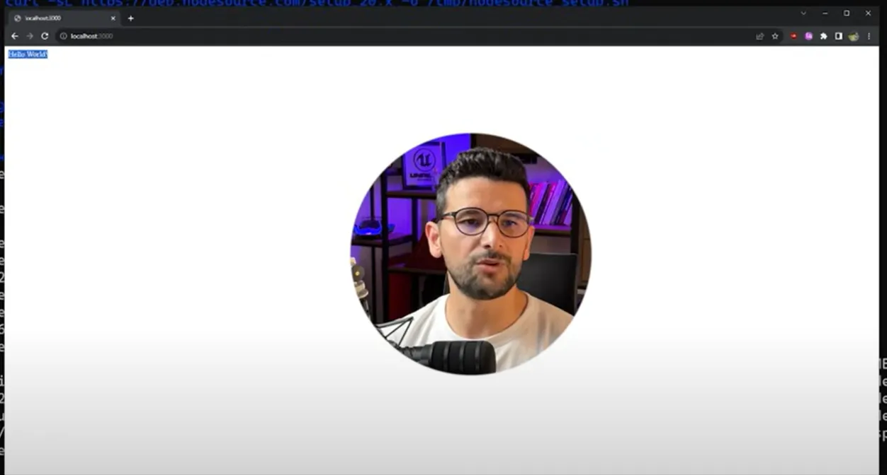

video1: [Ömer Bektaş Docker Kullanımı | Docker Nedir ? | Docker Geliştirme Ortamı](https://www.youtube.com/watch?v=dMJXptcnJoY&list=PLB1j0FQ4Fi10ABe5aEYmQKvor1SW-P5PU&index=1)


# Ubuntu İşletim sistemi örneği:

```bash
# ubuntu Image dosyasını indirdik
docker pull ubuntu

# run ile Image'dan Container yani sanal makineden bir bilgisayar yaratılacak
# start ile Container başlatılır
# stop ile Container durdurulur
docker run -d -t --name mydevc ubuntu


#tüm çalışan Container ları listele
docker ps

# bu kod ile Container içerisine girdik
# ubuntu işletim sistemindeki komut satırındayız buradan PHP MySQL Apache kurabilir istediğimiz gibi takılabiliriz 
# istediğimiz ortamı kurup, kurulumları yaptıktan sonra Container i durdurup tekrar açabilirsiniz
docker exec -it mydevc bash
```

>Kurulumlar ile uğraşmayalım hazır kullanalım dersek → DockerHub var burada kurulu Image’lar var. Tıpkı ubuntuyu indirdiğimiz gibi onu da indirip kullanabiliyoruz.

# Node Image kullanım örneği:

```bash
docker pull node:20

# Image ı çalıştır
docker run -d -t --name mydev-node node:20

# Image çalışıyor mu kontrol et 
docker ps

# bu Image ın içine girmek istersek
docker exec -it mydev-node bash
```

# Çalışan bir container a enjecte olma (yani oraya girip orada çalışma) örneği:

* VSCode aç

* Attach to Running Container…


* oluşturduğumuz mydev-node (yukarıdaki örnekte oluşturduğumuz Container)


* yeni pencere açıldı

* yeni pencere içinde “Open Folder” diyerek istediğimiz yere takılabiliriz


* app klasörü oluşturduk. içine app.js oluşturduk


* terminale “app# node app.js” yazarak hemen çalıştırdık. Terminalde çıktı aldık



> Biraz daha özelleştirilmiş, işletim sistemi seçip, nodejs ya da framework vb. kurabileceğimiz, bu framework ile ilgili indirilmesi gereken paketleri indireyim istiyorsanız. Yani her şeyi bir anda kurayım ve kullanıyım istiyorsanız → Dockerfile kullanmanız gerek.

# ubuntu ve nodejs kurmak için Dockerfile kullanma örneği:

* nodejs in mevcut iskelet kodları vardı bunların içine Dockerfile dosyası oluşturdu.

Dockerfile :
```Dockerfile
# Ubuntu ile başla / Eğer bilgisayarımıza daha önce inmediyse HUB üzerinden indirecek
FROM ubuntu

# Container içinde bu dizinde çalışacağım
WORKDIR /app

# Güncellemeleri yap ve curl kur
RUN apt update -y && apt install curl -y

# Nodejs indir
RUN curl -sL https://deb.nodesource.com/setup.../setup.sh
RUN bash /tmp/nodesource_setup.sh

# Nodejs kur
RUN apt install nodejs -y

# NPM ile nestjs cli kuruyoruz
RUN npm i -g 

# lokalimde project klasörü içindeki tüm dosyaları al, sunucuda app adlı klasör içine kopyala
COPY project/* /app/  

RUN npm install

# BAsh e devret
CMD ["npm", "run", "start:dev"]
```

* Terminalde Docker dizinine gittik ve burada komutumuzu yazmaya başladık

```bash
docker build -t mydevimg .
docker images
docker run -d -t --name mydevcus mydevimg
docker ps
```

* npm ile nestjs i çalıştırdık localhost:3000’de çalışıyor. Ama şuan ona erişemiyoruz burada “Port dinleme” işlemi yapmamız gerek.



> Yani bilgisayarımın 3000 portun çıkan paketlerin o  Container in içerisine girmesi için port yönlendirme işlemi yapmam gerek 

→ Container yaratma işlemini yeniden yapmak gerek

*bu sefer -p flagı ile bilgisayarımın 3000 portunu Container içerisindeki 3000 portuna yönlendir diyoruz*

```bash
# oluşturduğumuz Container i silelim
docker stop mydevcus
docker rm mydevcus

# yeniden Container yarat
docker run -d -t -p 3000:3000 --name mydevcus mydevimg
```

* tarayıcımızı yenilediğimizde çalıştığını göreceğiz



**Burada ne görüyoruz:** Bu bizim Container ımız içinde çalışan nestjs projesinden bize gelen sonuç yani portları doğru şekilde bağladığımız için 

bizim bilgisayarımızdan çıkan paketler → bizim Container imize gidiyor → Containerden çıkanlar da bizim bilgisayarımıza geliyor

*Buradaki bağlantıyı yapan -p flag i yani port flag i*