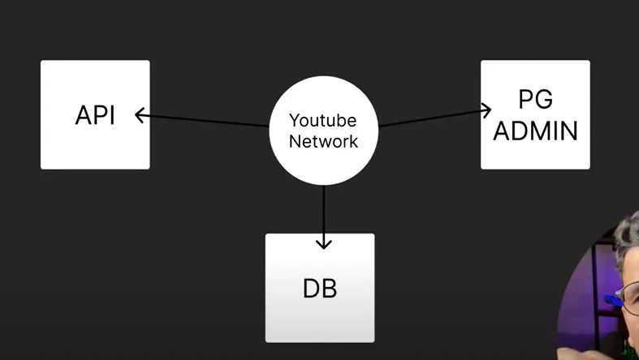
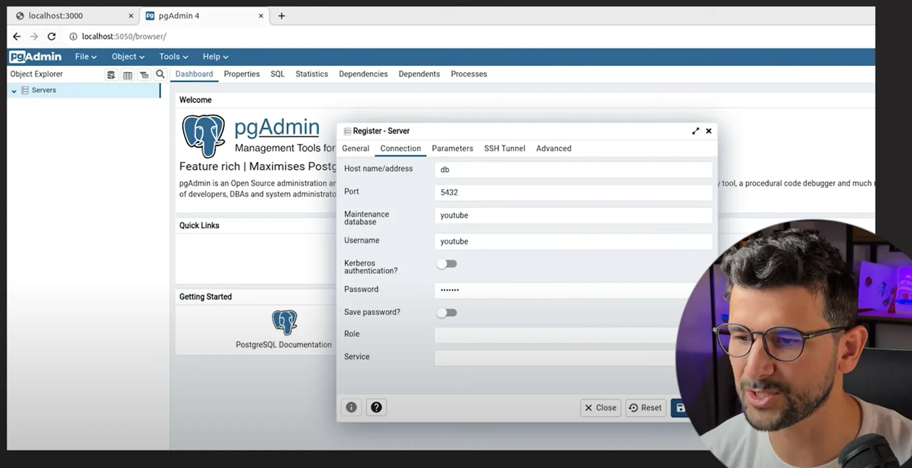
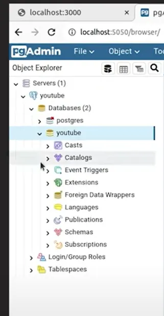
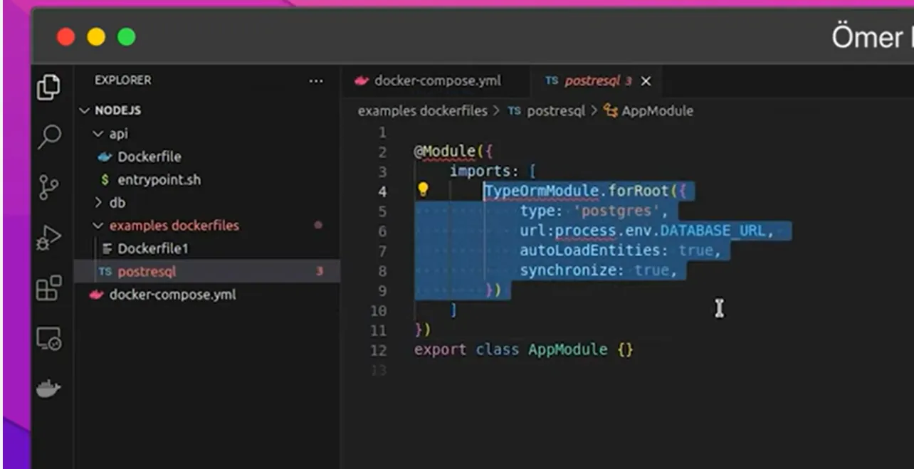
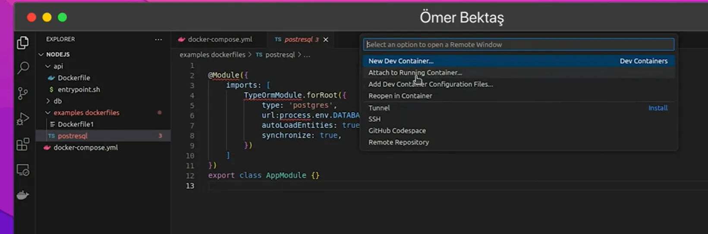
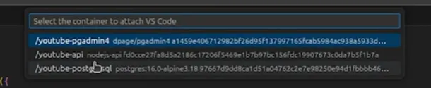
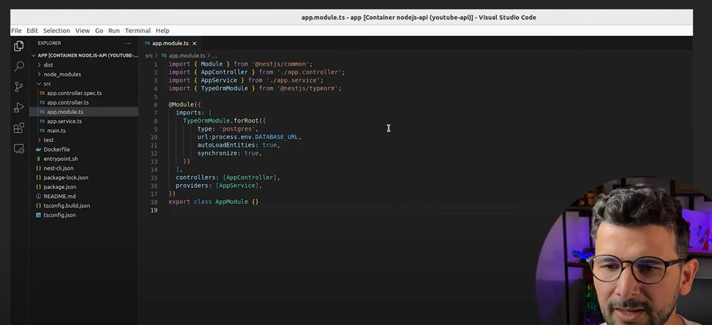

video2: [Ömer Bektaş Docker Compose Kullanımı | Docker Compose Nedir](https://www.youtube.com/watch?v=poQJCPbzX_E&list=PLB1j0FQ4Fi10ABe5aEYmQKvor1SW-P5PU&index=2&pp=iAQB)

# Docker Compose Kullanım Örneği


docker-compose.yml:
```yml
version: "3"

services:
	api: # Servisin adı
		container_name: youtube-api
		ports: # Servisin port yönlendirmesi
			- 3000:3000 # Host bilgisayarın 3000 portuna gelen istekleri container 3000 portuna yönlendir
		build: # Bu servis bir image'den doğmayacak yeniden inşa edilecek
			context: ./api
			dockerfile: ./Dockerfile
		networks:
			- youtube-network
		environment:
			- MODE_ENV=dev
			- DATABASE_URL=postgres://youtube:youtube@db:5432/youtube
	
	# Veritabanı servisi
	db:
		container_name: youtube-postgresql
		image: postgres:16.0-alpine3.18
		ports:
			- 5432:5432
		networks:
			- youtube-network
		volumes:
			- ./db:/var/lib/postgresql/data
			#- youtube-db:/var/lib/postgresql/data
		environment:
			- POSTGRES_USER=youtube
			- POSTGRES_PASSWORD=youtube
	
	# Veritabanı UI servisi
	pgadmin:
		container_name: youtube-pgadmin4
		image: dpage/pgadmin4
		environment:
			PGADMIN_DEFAULT_EMAIL: merbekta@gmail.com
			PGADMIN_DEFAULT_PASSWORD: 123456
		ports:
			- "5050:80"
		networks:
			- youtube-metwork
	
	#volumes:
		#youtube-db:
			#driver: local
	
```


> **networks** → servislerin birbirleri ile haberleşebilmeleri için gerekli olan ağ



örnekte 3 servise de “youtube-network” adlı network (kablo) bağlanmış. Bunlara aynı kablo bağlı olduğu için bunlar aynı network’te olacaklar. Aynı network’te oldukları için  de konuşabilecekler. Buna “Docker Networks” denir.

> db:**image** → burada **image tag** ı içinde postgres sql kullanmak istiyorum deyip. Bu  postgres sql i Docker Hub üzerinden indir ve kullan demek. sürümünü belirtmiş.

> **volume:** Bir Container yaratıldığında siz onu sildiğinizde içindeki dosyaların bazı şeylerin silinmesini istemiyorsanız bunu bir volume içine eklersiniz. Ve siz bu volume ü silmediğiniz sürece, Container ı silseniz de hiç fark etmez bu data kalmaya, yaşamaya devam eder. Burada kendimizi sağlama alıyoruz Container silinse bile databasedeki bilgilerim kaybolmasın diyoruz.

    db:volumes → bu proje dizini içinde yeni bir klasör oluşturup dataları orada tutmayı sağlar

> Eğer database dosyalarının bir klasör içinde tutulmasını istemiyorsanız bir hacmin içinde tutulsun benim gözüm görmesin istiyorsanız şu şekilde bir tanımlama gerekir:

    ```yaml
    db:
        ...
        volumes:
            - youtube-db:/var/lib/postgresql/data
        ...

    volumes:
        youtube-db:
            driver: local
    ```

> **api:build** → build etiketi şunu söyler “ben sana bir Image dosyası vermiycem ben sana bir Dockerfile vericem. Sen git o Dockerfile ı bir image haline getir daha sonra onu kullan”. 
context ile yerini göstermişiz:

```yaml
		build: # Bu servis bir image'den doğmayacak yeniden inşa edilecek
		context: ./api
		dockerfile: ./Dockerfile
```

API klasörü içindeki Dockerfile:

```Dockerfile
# Nodejs üzerine
FROM node:18.18.0-alpine

# Container içinde bu dizinde çalışacağım
# Container yaratılırken çalıştırılacak
WORKDIR /app

# NPM ile nestjs cli kuruyoruz
# Container yaratılırken çalıştırılacak
RUN npm i -g @nestjs/cli

# Bu dockerfile'ın bulunduğu klasöründeki her şeyi Container  içindeki app klasörüne kopyala
# Container yaratılırken çalıştırılacak
 COPY ./* /app/
 
 # Dosyaya çalışma izni ekle
 RUN chmod +x /app/entrypoint.sh
 
 # Container başlatıldıktan sonra çalışacak
 # CMD komutu Dockerfile içerisinde sadece 1 tane kullanılabilir
 # Birden fazla kullanım durumunda en son kullanılan komut geçeli olur
 CMD ["./entrypoint.sh"]
```

> **RUN & CMD farkı**
> ikisi de temelde komut çalıştırıyor ama çok büyük temel bir farkları var:
>
>CMD → Image yaratıldıktan sonra üzerine bazı işlemler yapmak istersek bunu kullanırız
>
>RUN →  Image yaratılırken Image ın içerisinde olması gereken bazı şeyleri yapıcaksak bunu kullanırız

örneğin nestjs/cli kurulmasını istemişim Image yaratılırken bu da içinde olsun istemişim. Yani oraya bir katman yerleştirmişim. Aynı şekilde [entrypoint.sh](http://entrypoint.sh) da RUN ile bu katmana işlenmiş.

Ama ben şunu isteseydim GitHub a git x projesini indir bu klasöre yaz, bu klasör içindeki şu dosyaları sil, tekrar bunu ekle gibi işlemler yapmak isteseydim bunları CMD ile kullanmam gerekirdi.

CMD’ye de bütün komutları yazdığımızda çok büyük bir komut yığını oluyor. Kötü görünmemesi ve uzun olmaması için tüm komutları tek dosyayı yazmışız adı “entrypoint.sh”. CMD ile bu dosyayı çalıştır demişiz.

> **entrypoint.sh**  → bu bir komut dosyası:

---

Gün sonunda Dockerfile ımız Image haline gelecek ve docker-compose.yml dosyamız da kullanılabilir hale gelecek

! **docker-compose.yml dosyamızı çalıştırabilmemiz için Dockerfile ile aynı dizinde olmalı**

Çalıştırma kodları:

* kurulum işlemlerini tamamlayıp servisleri ayağa kaldıracak kod:

```bash
docker compose up -d
```

up → servisleri ayağa kaldırır

down → servisleri kapatır

-d → bu bir flag. bunun sayesinde arkaplanda çalış beni rahatsız etme diyoruz


* pgAdmin  Server Registration


* pgAdmin’de oluşan veri tabanımız


* postresql


```postgresql
@Module({
	imports: [
		TypeOrmModule.forRoot({
			type: 'postgres',
			url:process.env.DATABASE_URL,
			autoLoadEntities: true,
			synchronize: true
		})
	]
})
export class AppModule {}
```

* Attach to Running Container 


* /youtube-pgadmin4


* açılan pencerede src/app.module.ts içindeki koda postresql dosyasında yazan kodu ekledik.


---

* servisleri durdurup containerları temizle:
```bash
docker compose down
```

* durdular mı kontrol edelim:
```bash
docker ps
```

* geçmişte duran var mı:
```bash
docker ps -a
```

---

**Sonuç:** Tek komut ile projem içindeki tüm servisleri ayağa kaldırdım ve yine tek komut ile hepsini kapattım.